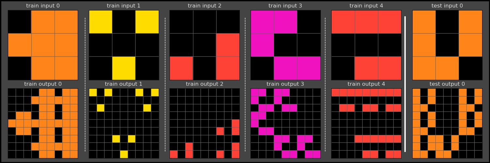
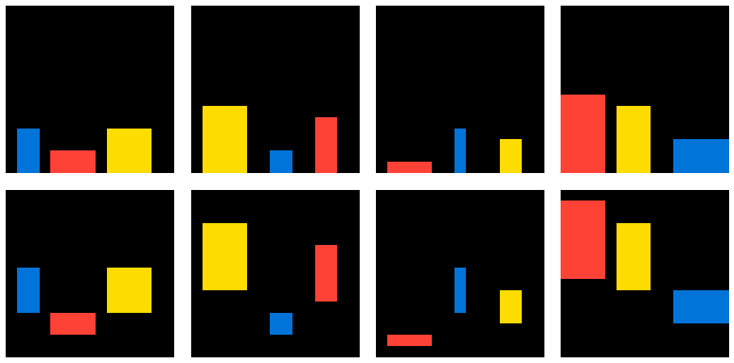

= Domain Specific Language for the Abstraction and Reasoning Corpus (ARC-DSL)
:idprefix:
:idseparator: -
:nofooter:
:sectanchors:
:sectlinks:
:sectnumlevels: 6
:sectnums:
:toc-title:
:toc: macro
:toclevels: 6

This is a fork of https://github.com/michaelhodel/arc-dsl The main reason this fork was created is because the original maintainer stopped accepting pull requests and some things rotted a bit. The initial fork mostly simply merges the pull requests that bring the repo back to life. We also took the chance to do some quality of life improvements. There are no major features added yet. ARC-AGI-2 support would be cool one day.

This repo defines a DSL for solving ARC-AGI problems. The main files are:

* link:dsl.py[]: defines primitive functions that transform the input in some way to get closer to the output
* link:solvers.py[]: contains hand crafted solutions to the 400 training problems of the ARC-AGI-1 public training set using the DSL
* link:arc_dsl_writeup.pdf[]: contains a more detailed description of the work

The test running of repository has no external dependencies, so to use it you can simply:

....
git clone --recursive https://github.com/arc-dsl-2/arc-dsl-2
cd arc-dsl-2
./main.py
....

And the expected output is:

....
400 out of 400 solvers formatted correctly.
400 out of 400 tasks solved correctly.
....

Tested on Ubuntu 25.04, Python 3.13.3.

toc::[]

== plot.py

link:plot.py[] is a helper script to plot JSON task files adapted from https://www.kaggle.com/code/allegich/arc-agi-2025-visualization-all-1000-120-tasks

To use it first install dependencies with:

[source,bash]
----
virtualenv -p python3 .venv
. .venv/bin/activate
pip install -r requirements.txt
----

Then you can view inputs and outputs of a task on a popup window with:

[source,bash]
----
./plot.py ARC-AGI/data/training/007bbfb7.json
----

or specifying the path by ID with:

[source,bash]
----
./plot.py -i 007bbfb7
----

and you can save to PNG instead of opening the popup window with:

[source,bash]
----
./plot.py -s ARC-AGI/data/training/007bbfb7.json
xdg-open ARC-AGI/data/training/007bbfb7.png
----

== Sample solver

=== 00d62c1b

image::media/00d62c1b.png[Task 00d62c1b]

[source,python]
----
def solve_00d62c1b(I):
    objs = objects(grid=I, univalued=T, diagonal=F, without_bg=F)
    black_objs = colorfilter(objs=objs, value=ZERO)
    borders = rbind(function=bordering, fixed=I)
    does_not_border = compose(outer=flip, inner=borders)
    enclosed = mfilter(container=black_objs, function=does_not_border)
    O = fill(grid=I, value=FOUR, patch=enclosed)
    return O
----

The function `solve_00d62c1b` takes an input grid `I` and returns the correct output grid `O`. An explanation of what the variables store and how their values were computed:

* `objs`: the set of objects extracted from the input grid `I` that are single-color only, where individual objects may only have cells that are connected directly, and cells may be of the background color (black); the result of calling the `objects` primitive on `I` with `univalued=True`, `diagonal=False` and `without_background=True`
* `black_objs`: the subset of the objects `objs` which are black; the result of filtering objects by their color, i.e. calling `colorfilter` with `objects=objs` and `color=ZERO` (black)
* `borders`: a function taking an object and returning `True` iff that object is at the border of the grid; the result of fixing the right argument of the `bordering` primitive to `I` by calling the function `rbind` on `function=bordering` and `fixed=I`
* `does_not_border`: a function that returns the inverse of the previous function, i.e. a function that returns `True` iff an object does not touch the grid border; the result of composing the `flip` primitive (which simply negates a boolean) and `borders`
* `enclosed`: a single object defined as the union of objects `black_objs` for which function `does_not_border` returns `True`, i.e. the black objects which do not touch the grid border (corresponding to the "holes" in the green objects); the result of calling `mfilter` (which combines `merge` and `filter`) with `container=black_objs` and `condition=does_not_border`
* `O`: the output grid, created by coloring all pixels of the object `enclosed` yellow; the result of calling the `fill` primitive on `I` with `color=FOUR` (yellow) and `patch=enclosed`

=== 5521c0d9

[source,python]
----
def solve_5521c0d9(I):
    objs = objects(grid=I, univalued=T, diagonal=F, without_bg=T)
    foreground = merge(containers=objs)
    empty_grid = cover(grid=I, patch=foreground)
    offset_getter = chain(h=toivec, g=invert, f=height)
    shifter = fork(outer=shift, a=identity, b=offset_getter)
    shifted = mapply(function=shifter, container=objs)
    O = paint(grid=empty_grid, obj=shifted)
    return O
----

* `objs`: the set of objects extracted from the input grid `I` that are single-color only, ignoring the background color; the result of calling the `objects` primitive on `I` with `univalued=True`, `diagonal=False` and `without_background=True`
* `foreground`: all the objects treated as a single object, the result of calling the `merge` primitive on the objects `objs`
* `empty_grid`: a new grid, where `foreground` is removed (covered), i.e. replaced with the background color (black); the result of calling the `cover` primitive with `grid=I` and `patch=foreground`
* `offset_getter`: a function that takes an object and returns a vector pointing up by as much as that object is high; the result of composing the three functions `toivec`, `invert` and `height`; the result of calling the `chain` primitive with `h=toivec`, `g=invert` and `f=height`
* `shifter`: a function that takes an object and shifts it as much upwards as it is high; the result of calling the `fork` primitive with `outer=shift`, `a=identity` and `b=offset_getter`
* `shifted`: all the objects shifted up by their heights, as a single object, obtained by applying the constructed function on the set of objects and merging the results; the result of calling the `mapply` primitive on `function=shifter` and `container=objs`
* `O` the desired output grid, obtained by painting the resulting object onto the grid `empty_grid` where the original objects were removed from; the result of calling the `paint` primitive on `grid=empty_grid` and `obj=shifted`
